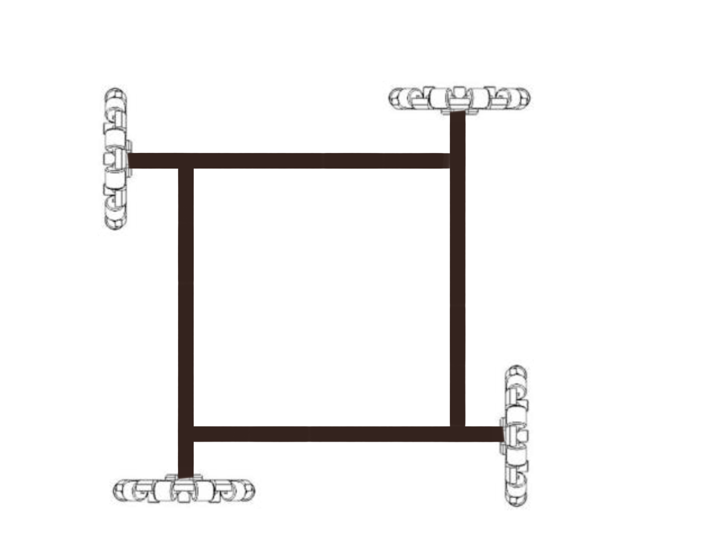
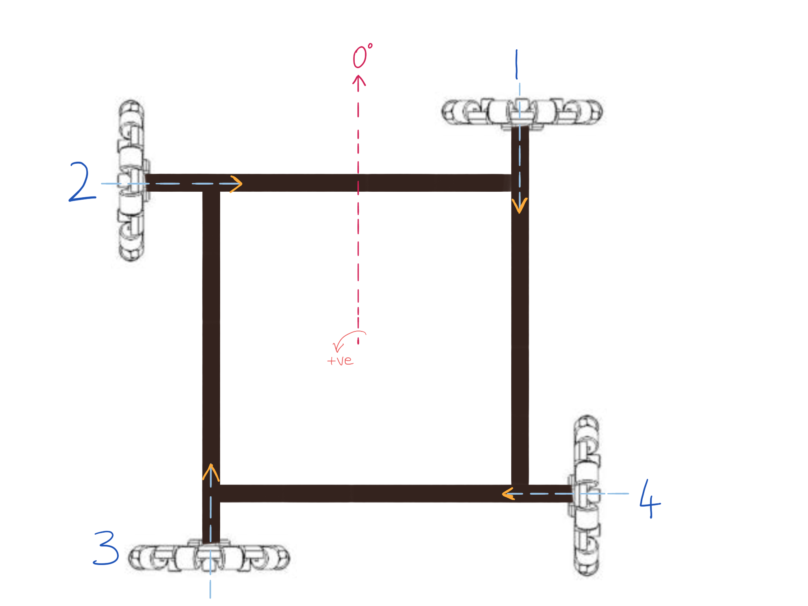
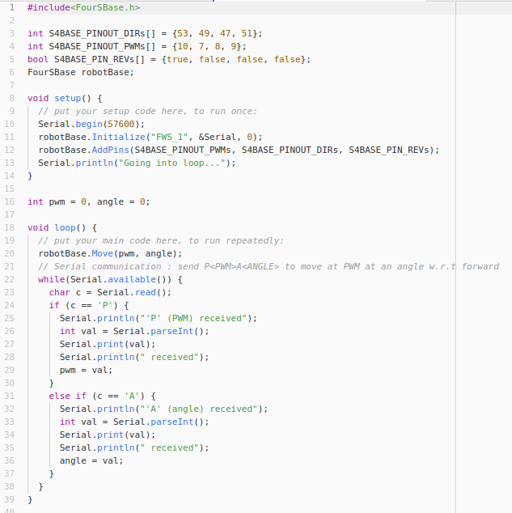

# Introduction
This library is to control a four wheel holonomic drive for omni wheels. This class is derived from [BotBase](../BotBase/) class, so it's suggested that you go through it's documentation first. 

## Information
### Testing
This library has been tested on the wheel configuration shown below

The image above is taken from the top view.
## Conventions
Please refer to the image below for the conventions used in this library

The image above is taken from the top view.
- The *whees* are numbered in a counter clockwise sence from 1 to 4.
- The *axis of rotation* is shown in light blue axis lines.
- The *sence of rotation* that is considered positive is shown by golden arrows for each wheel. Note that the axis of rotation is decided using the right hand rule.
    - For instance, the first wheel (top right) rotates in such a way that it's top point moves towards left and the bottom point moves towards right as seen from top view. Only then the rotation on the wheel is considered positive, else it's negative.

# Users Guide

## Downloading the Library
It's suggested that you download the entire repository and then select the folders `FourSBase` and `BotBase` (in case you haven't already imported it). This library depends upon the **BotBase** library (link [here](../BotBase/)).

## Using the library with Arduino
Move the folders into the *arduino libraries* folder on your PC. If you don't know where the libraries folder of your arduino installation is, you can check out the README file of this entire repository (click [here](../README.md)).

## Examples
After moving the library to the correct location, you can check the following examples.
### Example 1
You can check the **Competitions** repository (link [here](https://github.com/RoboManipal-9-0/Competitions)) for this example. The example we're looking for is [here](https://github.com/RoboManipal-9-0/Competitions/tree/master/WRO2018/Senior_Team/Testing_Codes/FourSBase_Test1) (WRO2018/Senior_Team/Testing_Codes/FourSBase_Test1). You can download it by clicking [here](https://minhaskamal.github.io/DownGit/#/home?url=https://github.com/RoboManipal-9-0/Competitions/tree/master/WRO2018/Senior_Team/Testing_Codes/FourSBase_Test1) and extracting the folder. The code inside the *.ino* file must look something like what's shown below

Before we get started with the example walkthrough, let's start with assumptions
- You are using motor drivers that require only two control inputs, PWM (PWM voltage) and DIR (Direction, 1 is +ve sence rotation and 0 is -ve sence rotation).
- Wheels are connected in the following manner to the microcontroller (Arduino Mega in our example). 

| Wheel number | PWM Pin | Direction pin | Direction Connection Reversed\* |
| :---------: | :-------: | :---------: | :-----------: |
| 1  | 10 | 53 | Yes |
| 2  |  7 | 49 | No  |
| 3  |  8 | 47 | Yes |
| 4  |  9 | 51 | No  |

\* *Direction connection reversed*: When you give 1 to DIR pin of that particular motor, it rotates in the -ve sence instead of the +ve sence. You can simply set up a boolean array as shown in code to handle this problem, no need of changing electrical connections. 
*You can have different connections as well, these are just for this example.*

# Developers Guide
