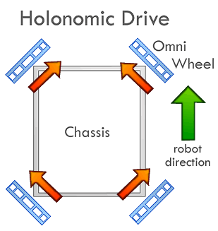
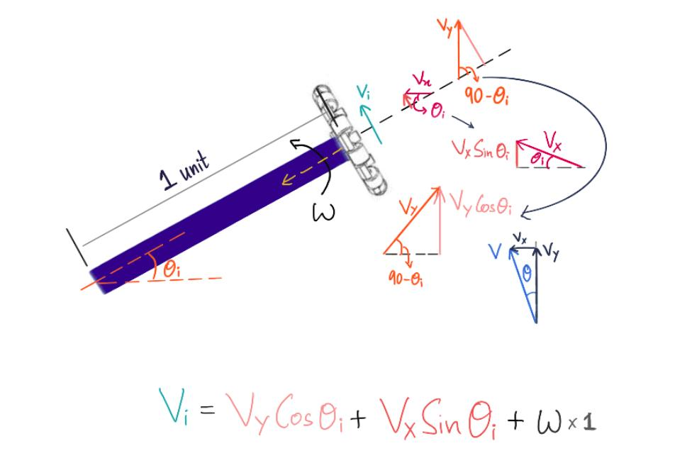

# Introduction
This library is for defining and controlling an **N** omni wheel base where all the axis of the wheels pass through a central point. It's like following the euler coordinate system.

The library stands for _N Wheel Concentric Holonomic Base_.

**Note**: This library is still in developer beta, ask the developer before using.

# Index
- [Introduction](#introduction)
- [Index](#index)
- [Users Guide](#users-guide)
    - [Downloading the library](#downloading-the-library)
    - [Using the library with Arduino](#using-the-library-with-arduino)
    - [Usage of the library](#usage-of-the-library)
    - [Examples](#examples)
        - [FourWheel45Omni](#fourwheel45omni)
        - [CycleContactWheels](#cyclecontactwheels)
- [Library Explanation](#library-explanation)
- [Developers Guide](#developers-guide)
    - [Class contents](#class-contents)
        - [Protected members](#protected-members)
            - [Variables](#variables)
            - [Member functions](#member-functions)
        - [Public members](#public-members)
            - [Constructors](#constructors)
            - [Member functions](#member-functions)
- [Debugger Notifications](#debugger-notifications)
    - [Debug level](#debug-level)
    - [Info level](#info-level)
- [References](#references)

# Users Guide
## Downloading the library
It is suggested that you download the entire repository and then select this folder, so that you can enjoy the benefits of VCS like git. It makes it simpler to update the contents whenever patch fixes are done. You can simply open a terminal (or gitbash on windows), go to the folder where you want to save this repository and type the following command.
```bash
git clone https://github.com/RoboManipal-9-0/Libraries.git -b dev
```
_You might want to omit the `-b <branch>` tag if you're downloading from the master version_.

**<font color="#AA0000">Not recommended</font>** : You can download just this folder by clicking [here](https://minhaskamal.github.io/DownGit/#/home?url=https://github.com/RoboManipal-9-0/Libraries/tree/dev/NWCHBase).

## Using the library with Arduino
Move this folder into the arduino libraries folder on your PC. If you don't know where the libraries folder of your arduino is, you can check out the README file of this entire repository for this, click [here](../README.md).<br>

## Usage of the library
- Create an object of the `NWCHBase` class.
- Initialize the number of wheels that the bot has and their respective angles (in ascending order). The wheels are numbered from 1 to **N** (number of wheels) in a counter clockwise fashion, however, they're indexed from 0 to **N-1**.
    - This can be done using the constructor of the `NWCHBase` class or the _InitializeWheels_ function.
    - Pass it first the number of wheels as an integer and then the angles (in degrees) as an integer array.
- Configure debugger using the `.debugger` member, if you're using it. More about it in the [DebuggerSerial documentation](./../DebuggerSerial).
- Attach the pins (PWM and DIR) of the motor driver using the _AttachPins_ function. You may configure the MaxMode using the _ConfigureMaxModeTo_ function. It's suggested that you check out the [BotBase documentation](./../BotBase/) for more.
- Call the _Move_ function to move the bot at a velocity, with some angle to the reference and having some angular velocity about the center of the bot. More about it in the [BotBase documentation](./../BotBase/).

You can check out the examples for more.

## Examples
In order to know these examples in detail, go through the [library explanation](#library-explanation) first.

### FourWheel45Omni
This code assumes that you have a four wheel bot with omni wheels at angles 45°, 135°, 225° and 315°, these are the **θ<sub>i</sub>** values. The bot must look something like this
[](https://www.google.co.in/url?sa=i&rct=j&q=&esrc=s&source=images&cd=&cad=rja&uact=8&ved=2ahUKEwjVvdiYtPTdAhXFsI8KHQ3QBGgQjRx6BAgBEAU&url=https%3A%2F%2Frenegaderobotics.org%2Frobotc-chassis-programming%2F&psig=AOvVaw2jddfq6ZmbYXwnhVE_geW1&ust=1539004341009670)<br>
The [file](./examples/FourWheel45Omni) is in the examples folder, open it in Arduino and upload it.<br>
**On the debugger**: Open the debugger serial (serial monitor in our case, because we used the default serial).<br>
Upon startup, you must see this on the DebuggerSerial (your timestamps might differ).
```
[0] > DebuggerSerial attached
[1] > Debugger set to SENSOR_FEED
[2 DEBUG] $FWBase$ Number of wheels set to 4
[7 INFO] $FWBase$ Initializing angle configuration: 45(0.79) 135(2.36) 225(3.93) 315(5.50) 
[14 INFO] $FWBase$ Motor number 1 attached to (PWM, DIR): 7, 50 Reverse DIR: TRUE
[21 INFO] $FWBase$ Motor number 2 attached to (PWM, DIR): 8, 51 Reverse DIR: FALSE
[28 INFO] $FWBase$ Motor number 3 attached to (PWM, DIR): 9, 52 Reverse DIR: TRUE
[35 INFO] $FWBase$ Motor number 4 attached to (PWM, DIR): 10, 53 Reverse DIR: FALSE
[43 DEBUG] $FWBase$ All pins attached
```
After the `Move` function is called, you must see something like this (again, your timestamps might differ)
```
[48 DEBUG] $FWBase$ Wheel motion vector: 70.71 -70.71 -70.71 70.71 
[52 DEBUG] $FWBase$ Vector[0] -> 70 = 70, HIGH
[56 DEBUG] $FWBase$ Vector[1] -> -70 = 70, LOW
[60 DEBUG] $FWBase$ Vector[2] -> -70 = 70, LOW
[64 DEBUG] $FWBase$ Vector[3] -> 70 = 70, HIGH
[68 DEBUG] $FWBase$ Mode: Standard
[71 DEBUG] $FWBase$ Motor 1 status = [7: 70, 50: 0]
[75 DEBUG] $FWBase$ Mode: Standard
[78 DEBUG] $FWBase$ Motor 2 status = [8: 70, 51: 0]
[82 DEBUG] $FWBase$ Mode: Standard
[87 DEBUG] $FWBase$ Motor 3 status = [9: 70, 52: 1]
[91 DEBUG] $FWBase$ Mode: Standard
[94 DEBUG] $FWBase$ Motor 4 status = [10: 70, 53: 1]
```
Notice the values that are written to the motors. If you get something similar, then you're good to go. 

Try passing different values to the **Move** function and observe the different results.

### CycleContactWheels
In this example, we explore a bot that can change wheel configurations in middle of movement. This example assumes that:
- For the first 5 seconds, the bot is the same as above (in the [FourWheel45Omni](#fourwheel45omni) example).
- After that the wheels align at 0°, 90°, 180° and 270°
- 5 more seconds and it becomes a three wheel bot with wheels at 90°, 210° and 330°.
- 5 more seconds and it becomes a two wheel bot with wheels at 0° and 180°.
- After 5 more seconds, it comes back to the first configuration.

You can go through the code to see how it's attained. Keep note of the following:
- Since we're not passing the updated angles, you won't get the messages on the debugger, but they're being updated in the motion parameters (they're passed and tracked by reference by the library). Due to this, you need to pass the angles array only once.
    - If you want the change notification in debugger serial, then pass them too in the **InitializeWheels** function.
- Angles are automatically tracked, so if you update the angles array (and have the same number of wheels), you don't need to do anything.
    - If your number of wheels change (for whatever reason), you need to update that parameter using the **InitializeWheels** function.

# Library Explanation
Here's the **mathematical derivation**.<br>
<br>
The explanation of every term is as follows:<br>
> **θ<sub>i</sub>** is the angle the i<sup>th</sup> wheel makes with the horizontal axis.<br>
> **V<sub>i</sub>** is the velocity vector of the i<sup>th</sup> wheel.<br>
> **V** is the command velocity. This is given with respect to the vertical (as shown by the triangle with acute angle θ). This is resolved into two components (**V<sub>x</sub>** and **V<sub>y</sub>**). Also, note that θ is measured with respect to vertical (as seen in the image). <br>
> **ω** or **w** is the desired angular velocity of the base with respect to the center point (where the two dashed orange lines meet). <br>

As you can observe, these two components of **V** (**V<sub>x</sub>** and **V<sub>y</sub>**) can further be broken into parallel to the axis of the wheels and perpendicular to the axis of the wheels. We take the ones perpendicular because only they can be achieved through the actuation.<br>
Add this with ω x 1 (velocity superimposed to get the angular velocity).

# Developers Guide
This library class inherits the **BotBase** class (documentation [here](./../BotBase/)). Let's have a detailed look at the contents of the class `NWCHBase`

## Class contents
This library consists of only one class, the `NWCHBase` class. Let's explore it's contents.

### Protected members

#### Variables
- **<font color="#CD00FF">int</font> \*angles** : This is an array consisting of angles (in degrees) of all the wheels (in the correct indexed order). It is basically contains the **θ<sub>i</sub>** values, but in degrees.

#### Member functions
- **<font color="#5052FF">void</font> <font color="#f2e165">Move_PWM_Angle</font>(<font color="#76bef2">int</font> PWM, <font color="#76bef2">float</font> angle_radians, <font color="#76bef2">float</font> w = 0)** : This function takes the velocity or _PWM_ (basically the **V** value) and the header direction angle (in radians), which is basically **θ** value. It also takes the angular velocity needed about the center of the bot (**w** or **ω** value). It calculates the velocity vector, which is all the **V<sub>i</sub>** values. It then calls the *VectorTo_PWM_DIR* function from the `BotBase` class. <br>
**NOTE**: The user only needs to call the `Move` function of the **BotBase** class.

### Public members
#### Constructors
- **<font color="#f2e165">NWCHBase</font>()** : Empty constructor.
- **<font color="#f2e165">NWCHBase</font>(<font color="#76bef2">int</font> num_wheels)** : Takes and initializes the number of wheels to *num_wheels*.
- **<font color="#f2e165">NWCHBase</font>(<font color="#76bef2">int</font> num_wheels, <font color="#76bef2">int</font> \*angles_deg)** : Takes and initializes the number of wheels (*num_wheels*). It also initializes the angle vector (list of **θ<sub>i</sub>** values) by degree to radian conversion and then into _angles_ vector.

#### Member functions
- **<font color="#5052FF">void</font> <font color="#f2e165">InitializeWheels</font>(<font color="#76bef2">int</font> num_wheels)** : Takes and initializes the number of wheels to *num_wheels*.

- **<font color="#5052FF">void</font> <font color="#f2e165">InitializeWheels</font>(<font color="#76bef2">int</font> \*angles_deg)** : Initializes the list of **θ<sub>i</sub>** values (all in degrees).

- **<font color="#5052FF">void</font> <font color="#f2e165">InitializeWheels</font>(<font color="#76bef2">int</font> num_wheels, <font color="#76bef2">int</font> \*angles_deg)** : Takes and initializes the number of wheels (*num_wheels*). It also initializes the angle vector (list of **θ<sub>i</sub>** values), basically assigns the _angles_ pointer.

**NOTE** : *angles_deg* is an array of angles in *degrees*. The degree to radian conversion is something the user needn't worry about. The library takes care of that.

# Debugger Notifications
Here are the messages that the library might send out onto the debugger. This library inherits the entire debugger from the `BotBase` library.

## Debug level
1. **Move_PWM_Angle** function<br>
Sends out the PWM vector
    ```bash
    Wheel motion vector: %val1% %val2% %val3% ... %valN%
    ```
    **For example:** <br>
    - For four wheels (don't pay attention to the values, they're arbitrary)
        ```bash
        Wheel motion vector: 76 54 -76 -54
        ```

## Info level
1. **InitializeWheels** function<br>
    Sends out an info message that the wheels have been initialized (it only notifies you about the angle vector)
    ```bash
    Initializing angle configuration: %ang1_deg%(%ang1_rad%) %ang2_deg%(%ang2_rad%) ... %angN_deg%(%angN_rad%)
    ```
    **For example:**<br>
    - For a four wheel bot
        ```bash
        Initializing angle configuration: 45(0.785398) 135(2.356194) 225(3.926990) 315(5.497787)
        ```
    - For a three wheel bot
        ```bash
        Initializing angle configuration: 90(1.570796) 210(3.665191) 330(5.759586)
        ```

# References
- [Paper for reference](https://www.mindraces.org/public_references/idsia_publications/omnidrive_kiart_preprint.pdf): idsia_publications/omnidrive_kiart_preprint.pdf

[](https://code.visualstudio.com/)
[](https://github.com/TheProjectsGuy)
[](https://github.com/RoboManipal-9-0/Libraries/issues/6)