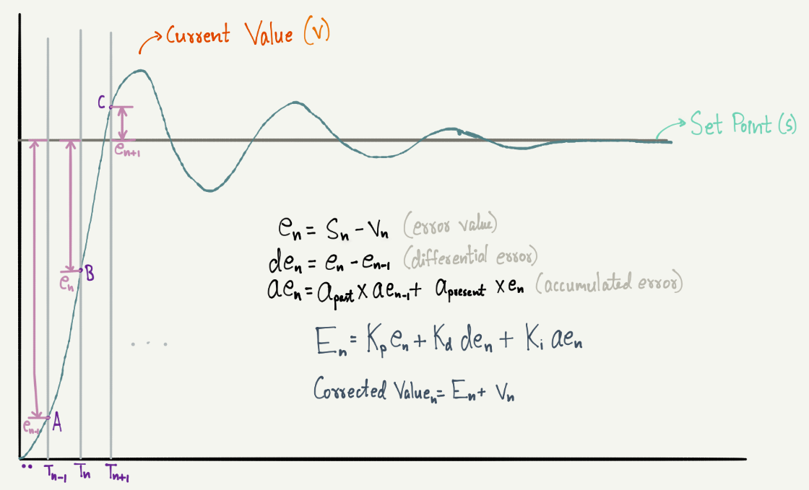

# Introduction
This library defines a PID controller (more info [here](https://en.wikipedia.org/wiki/PID_controller)).<br>

~~**WARNING**: This library is still in development. Please ask the developers before using it.~~ <br>
Beta testing done :tada:

# Index
- [Introduction](#introduction)
- [Index](#index)
- [User Guide](#user-guide)
    - [Downloading the library](#downloading-the-library)
    - [Using the library with Arduino](#using-the-library-with-arduino)
- [Library Explanation](#library-explanation)
- [Developers Guide](#developers-guide)
    - [Library Details](#library-details)
        - [Class implementation](#class-implementation)
            - [PIDController.h](#pidcontrollerh)
            - [PIDController.cpp](#pidcontrollercpp)
            - [keywords.txt](#keywordstxt)
            - [README.md](#readmemd)
        - [Class description](#class-description)
            - [Private members](#private-members)
                - [Variables](#variables)
                - [Member functions](#member-functions)
            - [Public Members](#public-members)
                - [Members](#members)
                - [Constructors](#constructors)
                - [Functions](#functions)
- [Debugger notifications](#debugger-notifications)
    - [Info level](#info-level)
    - [Debug level](#debug-level)

# User Guide
## Downloading the library
It is suggested that you download the entire repository and then select this folder, so that you can enjoy the benifits of VCS like git. It makes it simpler to update the contents whenever patch fixes are done. You can simply open a terminal (or gitbash on windows), go to the folder where you want to save this repository and type the following command.
```
git clone https://github.com/RoboManipal/Libraries.git -b dev
```
_You might want to omit the `-b <branch>` tag if you're downloading from the master branch_.

**Not recommended**: You can download _only_ this folder by clicking [here](https://minhaskamal.github.io/DownGit/#/home?url=https://github.com/RoboManipal/Libraries/tree/master/PIDController).

## Using the library with Arduino
Move this folder into the arduino libraries folder on your PC. If you don't know where the libraries folder of your arduino is, you can check out the README file of this entire repository for this, click [here](../README.md).<br>

# Library Explanation
Please refer to the following image for additional information

Here are a few descriptions and their relations with the variables, so that you know what the library is doing:
- Value **S<sub>n</sub>** is to indicate the set point (target) of the controller (variable _setPoint_). Value **V<sub>n</sub>** is to indicate the current value of the controlled signal (variable _currentValue_), **V<sub>n-1</sub>** stands for the previous value (variable _previousValue_). These values are recorded against timestamps denoted by **T<sub>n</sub>**.
- Value **e<sub>n</sub>** is the current error value (variable _currentErrorValue_). This makes **e<sub>n-1</sub>** the previous error value (variable _previousErrorValue_). The current error is for proportionality part of the controller.
- Value **de<sub>n</sub>** stands for difference error (or differential error). The code to calculate this is in *calculate\_Kd\_error* function.
- Value **ae<sub>n</sub>** stands for accumulated error (weighed sum of errors over time) (variable _accumulatedError_). The weights of the past accumulated error and current error to be added are **a<sub>past</sub>** and **a<sub>present</sub>** respectively. They're stored in variables _accFactorPast_ and _accFactorPresent_ respectively.
- Value **E<sub>n</sub>** is known as the total net error (calculated and returned using the _retError_ function). It's comprised of three sums which are proportionality part (variable *part_Kp*), differential part (variable *part_Kd*) and integral part (variable *part_Ki*). The function _getCorrectedValue_ returns the **Corrected Value<sub>n</sub>** for the controller.

# Developers Guide
Here is the developers guide to the library. <br>
This file is best viewed in the [_Atom_](https://atom.io/) text editor.

## Library Details
Here's a brief description of all the files in this library.

### Class implementation
Implementation of class is as shown below.

#### PIDController.h
This is the header file and contains the class blueprint (prototype). It contains the *PIDController* class. Details about the class is later in this documentation.

#### PIDController.cpp
This is the file that contains the main code for the class declared in *PIDController.h*.

#### keywords.txt
This file contains the keywords that we want the Arduino IDE to identify. This provides syntax highlighting features for the library for convenience of the programmer.

#### README.md
The description file containing details about the library. The file that you are looking at right now

### Class description
This library has the following classes
- PIDController
    - This class is the basic PID controller

**Class description for PIDController**
#### Private members
##### Variables
- **<font color="#CD00FF">double</font> Kp, Ki, Kd**: These are the PID parameters that can be adjusted for different dynamic and steady state responses.
- **<font color="#CD00FF">double</font> setPoint**: The target value that the control system has to achieve, as the steady state output.
- **<font color="#CD00FF">double</font> currentValue**: The current value of the control system which is achieved using a sensor feedback loop (passed through a transfer function). The current state value of the system, basically.
- **<font color="#CD00FF">double</font> previousValue**: The previous value of the system.
- **<font color="#CD00FF">double</font> currentErrorValue**: The current error value of the system. This is achieved by calculating `setPoint - currentValue` of the system. This is also called the _direct difference error_ of the system.
- **<font color="#CD00FF">double</font> previousErrorValue**: The previous value of the direct difference error. The `(currentErrorValue - previousErrorValue) * Kd` determines the dynamic characteristics of the system (damping on the system).
- **<font color="#CD00FF">double</font> accumulatedError**: The weighed sum of the current accumulated error and the current direct difference error. You can control the accumulation factor using the following variables. It's achieved by `accFactorPresent * currentErrorValue + accFactorPast * accumulatedError`. You can set the _accFactor_ values to better match your needs.
- **<font color="#CD00FF">double</font> accFactorPast, accFactorPresent**: The accumulation factors (as observed in the above equation) of the accumulated error values. These together with _Ki_ determine the steady state performance of the system.
- **<font color="#CD00FF">double</font> part_Kp, part_Kd, part_Ki**: The part of the error associated to proportionality, derivative and integral respectively. The error is calculated using `part_Kp +part_Kd + part_Ki` and received using the _retError_ function.

##### Member functions
- **<font color="#CD00FF">void</font> <font color="#5052FF">calculateError</font>()**: Calculates the _previousErrorValue_, _currentErrorValue_ and _accumulatedError_ using the following three formulas.
```
previousErrorValue := currentErrorValue
currentErrorValue := setPoint - currentValue
accumulatedError := currentErrorValue * accFactorPresent + accumulatedError * accFactorPresent
```
- **<font color="#CD00FF">void</font> <font color="#5052FF">calculate_Kp_error</font>()**: Calculates the proportionality part of the error, which is `Kp * currentErrorValue`.
- **<font color="#CD00FF">void</font> <font color="#5052FF">calculate_Kd_error</font>()**: Calculates the differential part of the error, which is `Kd * (currentErrorValue - previousErrorValue)`.
- **<font color="#CD00FF">void</font> <font color="#5052FF">calculate_Ki_error</font>()**: Calculates the integral part of the error, which is `Ki * accumulatedError`.
- **<font color="#CD00FF">void</font> <font color="#5052FF">assignParameters</font>(<font color="#FF00FF">double</font> Kp, <font color="#FF00FF">double</font> Ki, <font color="#FF00FF">double</font> Kd)**: Assigns the values of Kp, Ki and Kd to the passed values.

#### Public Members
##### Members
- **<font color="#CD00FF">DebuggerSerial</font> debugger**: The debugger for the class. Check the [DebuggerSerial documentation](./../DebuggerSerial/) for more on this.
  
##### Constructors
- **<font color="#5052FF">PIDController</font>()**: Empty constructor of the class. It sets both the integral accumulation factors to 0.5 (their default value).

##### Functions
- **<font color="#CD00FF">void</font> assignPIDParameters(<font color="#FF00FF">double</font> Kp, <font color="#FF00FF">double</font> Ki, <font color="#FF00FF">double</font> Kd)**: Assigns the PID parameters.
- **<font color="#CD00FF">void</font> assignSetPoint(<font color="#FF00FF">double</font> setPointValue)**: Assigns the _setPoint_ value (target value) for the controller to achieve.
- **<font color="#CD00FF">void</font> setAccFactor(<font color="#FF00FF">double</font> newValuePast, <font color="#FF00FF">double</font> newValuePresent)**: Sets the value of _accFactorPast_ to _newValuePast_ and _accFactorPresent_ to _newValuePresent_. Adjusts the updation parameters of integral error (accumulatedError) part.
- **<font color="#CD00FF">void</font> assignCurrentValue(<font color="#FF00FF">double</font> currentValue)**: Assigns the _currentValue_ to the controller.
- **<font color="#CD00FF">double</font> retError()**: Returns the error value calculated using `part_Kp +part_Kd + part_Ki`.
- **<font color="#CD00FF">double</font> retError(<font color="#FF00FF">double</font> currentValue)**: Assigns the current value and then returns the error.
- **<font color="#CD00FF">double</font> retError(<font color="#FF00FF">double</font> setPoint, <font color="#FF00FF">double</font> currentValue)**: Assigns the _setPoint_ and _currentValue_ and then returns the error.
- **<font color="#CD00FF">double</font> getCorrectedValue()**: It calculates the error (using the _retError_ function) and returns `error + currentValue`. This is called the _correctedValue_.
- **<font color="#CD00FF">double</font> getCorrectedValue(<font color="#FF00FF">double</font> currentValue)**: Sets the _currentValue_ and then returns the _correctedValue_.
- **<font color="#CD00FF">double</font> getCorrectedValue(<font color="#FF00FF">double</font> setPoint, <font color="#FF00FF">double</font> currentValue)**: Sets the _setPoint_ and _currentValue_, then returns the _correctedValue_.

# Debugger notifications
## Info level
1. **assignParameters** function<br>
    Notifies about the current Kp, Ki and Kd values
    ```
    [%TIMESTAMP% INFO] $%name%$ Kp: %Kp%, Ki: %Ki%, Kd: %Kd%
    ```
    For example:<br>
    - If 10054 milliseconds after starting, the parameters are initialized to `Kp = 0.5`, `Kd = 0.03` and `Ki = 0.002` and the debugger is named `PID_base_controller`.
        ```
        [10054 INFO] $PID_base_controller$ Kp: 0.5, Ki: 0.002, Kd: 0.03
        ```

2. **setAccFactor** function<br>
   Notifies about the change in accumulation factor (gives you previous and current values).
   ```
   [%TIMESTAMP% INFO] $%name%$ Accumulation factors updated {Past: %old_accFactorPast% to %new_accFactorPast%, Present: %old_accFactorPresent% to %new_accFactorPresent%}
   ```
   For example:<br>
   - If 10956 milliseconds after starting, the accumulation parameters were updated, _accValuePast_ became 0.004 from 0.003 and _accValuePresent_ became 0.050 from 0.070. The debugger is named `PID_base_controller`. 
        ```
        [10956 INFO] $PID_base_controller$ Accumulation factors updated {Past: 0.003 to 0.004, Present: 0.070 to 0.050}
        ```
## Debug level
1. **assignSetPoint** function<br>
    Notifies about the set point being assigned
    ```
    [%TIMESTAMP% DEBUG] $%name%$ Set point value assigned: %setPointValue%
    ```
    For example:
    - Debugger name is `PID_debug`. After 15843 milliseconds from start, set point is set to 45.
        ```
        [15843 DEBUG] $PID_debug$ Set point value assigned: 45
        ```
2. **assignCurrentValue** function<br>
    Notifies about the current value being updated. 
    ```
    [%TIMESTAMP% DEBUG] $%name%$ Current value assigned: %currentValue%
    ```
    For example:
    - Debugger name is `PID_debug`. After 17862 milliseconds from start, current value is set to 20.
        ```
        [17862 DEBUG] $PID_debug$ Current value assigned: 20
        ```
3. **calculateError** function<br>
    Calculates all the error parts (proportional, derivative and integral) and notifies about the result. Note that only the error values are displayed here, not the error parts. They're displayed by functions **calculate_Kp_error**, **calculate_Kd_error** and **calculate_Ki_error**.
    ```
    [%TIMESTAMP% DEBUG] $%name%$ Errors (P, D and I): %Ep%, %Ed%, %Ei%
    ```
    For example:
    - Debugger name is `PID_debug`. After 18000 milliseconds from start, errors are 10, -0.5 and 0.03.
        ```
        [18000 DEBUG] $PID_debug$ Errors (P, D and I): 10, -0.5, 0.03
        ```
4. **calculate_Kp_error** function<br>
    Calculates the proportional error part and puts the result.
    ```
    [%TIMESTAMP% DEBUG] $%name%$ Kp_Error: %Kp% * %currentErrorValue% = %part_Kp%
    ```
    For example:
    - Debugger name is `PID_debug`. After 16543 milliseconds from start, proportional error is 18 (setPoint - currentValue), Kp was set to 0.8.
        ```
        [16543 DEBUG] $PID_debug$ Kp_Error: 0.8 * 18 = 14.4
        ```
5. **calculate_Kd_error** function<br>
    Calculates the derivative error part and puts the result.
    ```
    [%TIMESTAMP% DEBUG] $%name%$ Kd_Error: %Kd% * %differentialError% = %part_Kd%
    ```
    For example:
    - Debugger name is `PID_debug`. After 18543 milliseconds from start, derivative error is -10 (current proportional error - previous proportional error), Kd was set to 0.5.
        ```
        [18543 DEBUG] $PID_debug$ Kd_Error: 0.5 * -10 = -5
        ```
6. **calculate_Ki_error** function<br>
    Calculates the integral error part and puts the result.
    ```
    [%TIMESTAMP% DEBUG] $%name%$ Ki_Error: %Ki% * %accumulatedError% = %part_Ki%
    ```
    For example:
    - Debugger name is `PID_debug`. After 919700 milliseconds from start, integral error is 75 (accumulated error over past and present), Ki was set to 0.05 initially.
        ```
        [919700 DEBUG] $PID_debug$ Ki_Error: 0.05 * 75 = 3.75
        ```
7. **retError** function<br>
    Returns the total, final error (which must be added to the current value). It is the sum of the results of the functions **calculate_Kp_error**, **calculate_Kd_error** and **calculate_Ki_error**. This is printed to the debugger.
    ```
    [%TIMESTAMP% DEBUG] $%name%$ Total error: %totalError%
    ```
    For example:
    - Debugger name is `PID_debug`. After 17600 milliseconds, the total error is calculated to be 0.5.
        ```
        [17600 DEBUG] $PID_debug$ Total error: 0.5
        ```
8. **getCorrectedValue** function<br>
    Returns the corrected value. This is sum of the total error and current value. 
    ```
    [%TIMESTAMP% DEBUG] $%name%$ Corrected value: %value%
    ```
    For example:
    - Debugger name is `PID_debug`. After 6800 milliseconds, the corrected value is 8.
        ```
        [6800 DEBUG] $PID_debug$ Corrected value: 8
        ```

[](https://code.visualstudio.com/)
[](https://github.com/TheProjectsGuy)
