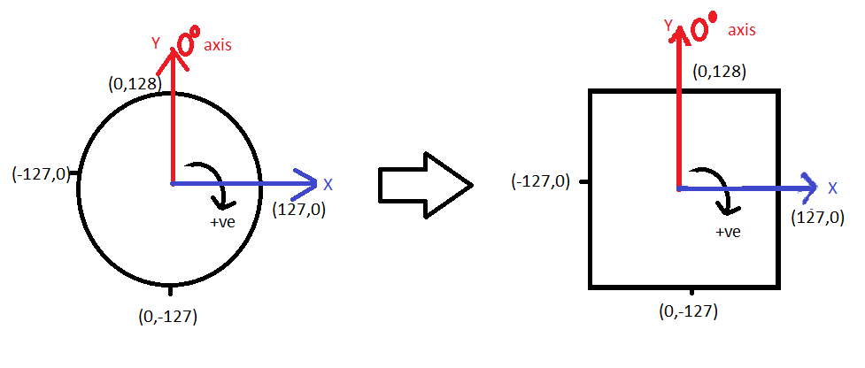

# Introduction
This library helps interface a PS2 Controller with Arduino and calculate normalised paramters such as the angle
and speed of the bot motion. This class uses the modified Cytron PS2 Shield library.

# User's Guide
## Conventions
Please refer to the image below for the conventions followed in the library.

The image is taken from top view.
- The same convention is followed for both the joystick values, i,e right and left.
- The *zero axis* is shown in red. The cartesian coordinate frame is as marked in the figure.
- The maximum values of the speed of motion are recorded along the circumference of the circle.

## Downloading the Library
It's suggested that you download the entire repository and then select the folders `PS2Controller` and `CytronPS2` (in case you haven't already imported it). This library depends upon the **CytronPS2** library

## Using the library with Arduino
Move the folders into the *arduino libraries* folder on your PC.

## Examples
After moving the library to the correct location, you can check the following examples.

The first two examples are to give you a basic introduction to the CytronPS2 library
### Example
The example we're looking for is 

Create an object with the Software Serial pins of your choice.
```
PS2Controller my_object_name( RX_pin, TX_pin;
```
- Simply, make the required connections of the PS2Shield and the Arduino and upload this code to Arduino Mega/Uno etc. Play around with the joystick and the position , required angle and speed are displayed on your serial monitor.

Note:
- Set the baudrate of the PS2 Serial that matches with the jumper setting on the PS2 Shield.
- Do not call the Initialize() function if you are using it with Hardware Serial.

# Developers guide

## Library Details
### Files in the Library
The files in the library are :

#### PS2Controller.h
This is the header file and contains the class blueprint (prototype). We will explore the details about the class soon.

#### PS2Controller.cpp
This is the file that contains the main code for the class. In the header file, only the function prototypes are mentioned, the code for the functions (definition) are present in this file.

#### README.md
The description file containing details about the library. The file that you at right now.

###  Class Description
This library assumes that you have a Cytron PS2 Shield and have established the connection with the PS2 Controller.

#### Protected Members
#### Variables

- **<font color="#CD00FF">int</font> rx_pin**: The RX pin for initialising Software Serial.

- **<font color="#CD00FF">int</font> tx_pin** : The RX pin for initialising Software Serial.

- **<font color="#CD00FF">float</font> right_x** : Analog values read from the right joystick. ( Value of the X coordinate from 0-255, that is later mapped from -127 to 128)

- **<font color="#CD00FF">float</font> right_y** : Analog values read from the right joystick. ( Value of the X coordinate from 0-255, that is later mapped from -127 to 128)

- **<font color="#CD00FF">float</font> left_x** : Analog values read from the left joystick. ( Value of the X coordinate from 0-255, that is later mapped from -127 to 128)

- **<font color="#CD00FF">float</font> left_y** : Analog values read from the left joystick. ( Value of the X coordinate from 0-255, that is later mapped from -127 to 128)

- **<font color="#CD00FF">bool</font> (X)_Bstate** : Returns the state of the button X: ( start/ select/ triangle/ circle/ cross/ square) . It is equal to 1 if the button's been pressed and 0 otherwise.

- **<font color="#CD00FF">CytronPS2</font> ps2** : Creates an object of the Cytron_PS2Shield class

- **<font color="#CD00FF">DebuggerSerial</font> debugger** : Creates an object of the DebuggerSerial class

#### Public Members

##### Constructors

- **<font color="#5052FF">PS2Controller</font>(<font color="#CD00FF">int</font> rx_pin, <font color="#FFB300">int</font> tx_pin)** : Initialization constructor for the class. It calls the *Initialize* function of the Cytron_PS2Shield library to initialise software serial pins.

##### Variables
- **<font color="#CD00FF">int</font> speeds** : It is the speed at which the bot is required to move. This has been kept intentionally public to enable arduino codes to access and modify it

- **<font color="#CD00FF">float</font> angle** : It is the angle at which the bot is required to move. This has been kept intentionally public to enable arduino codes to access and modify it

##### Member Functions
- **<font color="#CD00FF">void</font> <font color="#5052FF">InitializeDebugger</font>(<font color="#FFB300">HardwareSerial</font> \*debugger_serial, <font color="#CD00FF">int</font> Level)** : To assign *debugger_serial* and *Level* to the *ps2DebuggerSerial* and *debuggerPriorityLevel* respectively.

- **<font color="#CD00FF">void</font> <font color="#5052FF">ReadButtonStates</font>(<font color="#FF00FF">String</font> button)** : To check if the *button* has been pressed

- **<font color="#CD00FF">void</font> <font color="#5052FF">ReadPS2Values</font>()** : Calculates the raw analog values returned by the joystick. ( Values range from 0-255 )

- **<font color="#CD00FF">void</font> <font color="#5052FF">AdjustCoordinates</font>(float scaling_factor)** : Adjust the range of coordinates from 0-255 to -127-128. This is done in order to have an origin ( centre of joystick ) correspond to (0,0). It also maps the circular space of a joystick such that every point on its circumference corresponds to max. speed.
The scaling_factor here is ratio of the max speed of motion desired to 127.
eg. if we require a maximum speed of 230, scaling_factor would be 230/127.

```
this->speeds=pow(pow(this->left_x,2)+pow(this->left_y,2),0.5);
```
The values have been mapped as shown below:


The values obtained form a rectangular coordinate system with X and Y values ranging from -128 to 127. We first map it from -127 to 127 and then use simple stretch to map the values to a circle.
For the derivation , have a look at the research paper below. ( We have used the simple stretch method)
[map](../.DATA/ResearchPaper/Mapping.pdf)

- **<font color="#CD00FF">void</font> <font color="#5052FF">CalcAngleSpeed</font>()** : To calculate the angle and speed of the desired bot motion from the position of the joystick.

### Additional References
EduBot Cytron Tutorial with PS2 Shield : - [Cytron-PS2-Shield Tutorial](https://tutorial.cytron.io/2015/07/23/using-cytron-ps2-shield-with-arduino-edubot-2/)
Original Cytron PS2 Shield library : [Cytron-PS2-Shield](https://github.com/CytronTechnologies/Cytron_PS2Shield)

[](https://atom.io/)
